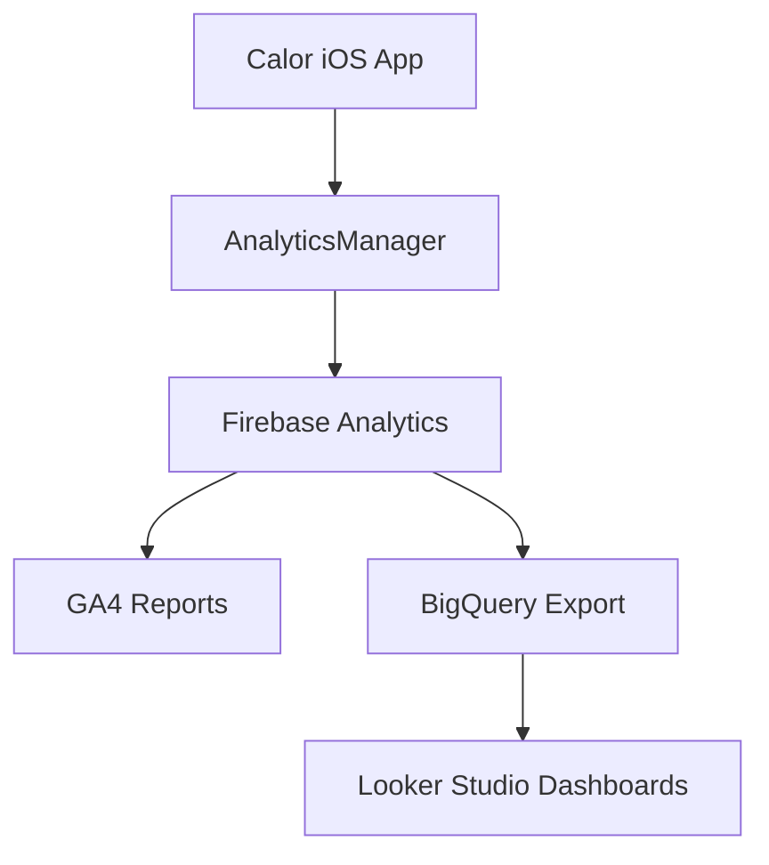

# Calor Aggregate Analytics

Calor uses an aggregate-first analytics model. The iOS app sends sanitized Firebase Analytics events through `AnalyticsManager`; raw per-user behavior timelines, exact coordinates, emails, names, food photos, and free-text meal content are intentionally excluded.

## Event Pipeline



## MVP Events

- `screen_view`, `screen_dwell`, `section_reached`, `tab_selected`, `button_tap`
- `session_start`, `session_end`, `app_lifecycle`
- `login`, `sign_up`, `logout`, `account_deleted`
- `food_scan`, `food_logged`, `meal_deleted`, `goal_updated`, `weight_logged`
- `meal_plan_viewed`, `meal_plan_generated`, `restaurant_viewed`, `meal_order_clicked`
- `gym_selected`, `gym_booking_opened`, `workout_class_action`
- `choice_set_presented`, `choice_selected`
- `permission_result`, `health_metric_loaded`, `reminder_toggle_changed`, `progress_range_selected`
- `pending_meal_action`, `group_created`, `group_joined`, `post_shared`, `comment_added`, `reaction_added`
- `paywall_shown`, `paywall_dismissed`, `paywall_plan_selected`, subscription events

## Allowed Dimensions

Use only aggregate-safe dimensions such as screen name, feature name, tab name, duration bucket, calorie bucket, time-of-day bucket, meal type, provider, gym ID/name, restaurant name, city/country when already available from the profile, permission status, surface, item type, selected rank, candidate count, visible count, algorithm version, language, app version, and subscription state.

Do not add exact latitude/longitude, emails, display names, URLs, long numeric identifiers, image metadata, meal free text, or raw user behavior histories.

## Signal Gap Coverage

The codebase now covers the important gaps from the intelligence strategy:

- Voice logging emits speech/microphone permission outcomes, voice analysis success/failure, and pending voice meal creation.
- Pending meals emit creation, analysis ready/failed, quick-save, review-save, and quick-save failure events.
- Weight logging emits manual and HealthKit weight log events without sending raw weight values.
- HealthKit emits enablement outcomes and bucketed step/active-energy reads.
- Free limits emit `free_limit_hit` before paywall display for scan, voice, and meal suggestion gates.
- Subscriptions emit purchase started, purchased, restored, and subscription state updates.
- Community emits group create/join, post share, comment, and reaction events without names or content.
- Notifications, camera, microphone, speech, and HealthKit permissions are tracked as low-cardinality outcomes.
- Meal plan, restaurant/order, gym, class list, and suggested workout surfaces emit choice context so analysis can compare what was shown against what was selected.

## Decision-Quality Events

Use these events when the app shows a user multiple meaningful options and the product needs to understand why one option wins.

- `choice_set_presented`: one event when a recommendation surface renders. Send `surface`, `item_type`, `candidate_count`, `visible_count`, `source`, and `algorithm_version`.
- `choice_selected`: one event when the user picks an option or takes a strong action. Send `surface`, `item_type`, `action_name`, `selected_rank`, `candidate_count`, `visible_count`, and domain dimensions such as `restaurant`, `meal_type`, `order_route`, `provider`, `gym_id`, `gym_name`, or `city`.

Current surfaces:

- `home_meal_plan`: planned meals shown and selected for details/logging.
- `meal_detail`: meal logged or order route clicked after detail review.
- `partner_gyms_card`: gym branches shown and selected.
- `partner_gyms_map` and `partner_gyms_fullscreen_map`: gym selected from maps.
- `selected_gym_classes`: class options shown and selected for details.
- `suggested_burn`: suggested workout surfaced to cover calories.

This is intentionally different from tracking every tap. It captures the decision context: what type of choice was shown, where it appeared, how many options existed, which rank was chosen, and what action followed.

## Derived Metrics

Compute intelligence in BigQuery or aggregate Firestore summaries. Do not add more raw event payloads just because a dashboard needs a metric.

- Activation: `onboarding_started` to first `food_logged`, grouped by first logging source and time-to-first-value bucket.
- AI logging funnel: `screen_view` for Camera to `pending_meal_action=created` to `food_scan success=true` to `food_logged`.
- Pending meal funnel: `pending_meal_action=created` to `analysis_ready`, `analysis_failed`, `quick_saved`, `review_saved`, or `quick_save_failed`.
- Habit formation: active days with `food_logged`, common `time_of_day_bucket`, and 3/7/14 day return after first food log.
- Meal plan conversion: `meal_plan_viewed` to `food_logged` with meal-plan source to `meal_order_clicked`.
- Choice quality: `choice_set_presented` to `choice_selected`, grouped by surface, item type, selected rank, and algorithm version.
- Restaurant intent: `restaurant_viewed` and `meal_order_clicked` by `restaurant`, `meal_type`, `order_route`, city/country when present.
- Gym intent: `gym_selected` to `gym_booking_opened` to `workout_class_action=done`, grouped by provider and city.
- Progress loop: `weight_logged`, `health_metric_loaded`, `progress_range_selected`, and progress screen dwell.
- Paywall conversion: `free_limit_hit` or `paywall_shown` to `subscription_purchase_started` to `subscription_purchased`, grouped by trigger and plan.
- Community retention: group joined/created and post/comment/reaction activity compared with food-log retention cohorts.

## Privacy Boundary

Aggregate analytics is for product decisions. Per-user personalization profiles are intentionally out of scope for this layer.

Keep Firebase Analytics aggregate-only:

- Do not call `Analytics.setUserID` with app user IDs.
- Do not send user names, emails, post/comment text, group names, exact location, food photos, raw HealthKit samples, raw weights, or deep-link URLs.
- Use buckets for time, duration, calories, steps, active energy, days, and price.
- Keep dimensions closed-vocabulary wherever possible.

Do not use this analytics layer to build user-level profiles. If Calor later adds personalization, it should be a separate consented system with its own data model, retention policy, and deletion flow.

## Dashboard Definitions

Create Looker Studio dashboards from BigQuery views with these core cards:

- Activation dashboard: onboarding started/completed, sign-up/login, first food log, time to first value.
- AI logging dashboard: camera/gallery/voice usage, analysis success rate, pending save method, scan errors.
- Meal plan dashboard: plan views, regeneration, meal-plan food logs, restaurant views, order route clicks.
- Choice quality dashboard: choice set presentations, selected rank distribution, selection rate by surface, and algorithm version.
- Gym dashboard: gym selections, booking opens, class booked/done, provider and city interest.
- Restaurant dashboard: restaurant views/clicks by route, meal type, and coarse city/country.
- Paywall dashboard: free limit hits, paywall shown/dismissed, plan selected, purchase started, purchased/restored.
- Retention dashboard: D1/D7/D14 return after first food log, retention by first logging source, community participation, notification/HealthKit opt-in cohorts.

## BigQuery Setup

Enable the Firebase Analytics BigQuery export in the Firebase console for project `calor-97932`:

1. Open Firebase console.
2. Go to Project settings.
3. Open Integrations.
4. Link BigQuery.
5. Enable daily export and streaming export only if near-real-time dashboards are needed.

Keep Firestore for product data and selected aggregate summaries only. Do not use Firestore as the raw event store.

The dashboard SQL assumes:

- Raw Firebase export dataset: `calor-97932.analytics_517822938`
- Analytics view dataset: `calor-97932.analytics_views`

Create `analytics_views` in BigQuery before running `docs/analytics_dashboards.sql`.

For cheaper ad hoc queries against raw Firebase tables, always filter by date suffix when possible:

```sql
WHERE _TABLE_SUFFIX BETWEEN '20260514' AND '20260521'
```

Use the flattened `calor_events` view for repeated dashboard work instead of copying many `UNNEST(event_params)` expressions into every query.

## DebugView Testing

Firebase Analytics DebugView needs Analytics enabled in `GoogleService-Info.plist` and an Analytics-specific launch argument.

1. Open the `Calor` scheme in Xcode.
2. Select Run > Arguments.
3. Add this launch argument:

```text
-FIRDebugEnabled
```

4. Run the app from Xcode, not by tapping an already-installed simulator app icon.
5. Open Firebase Console > Analytics > DebugView.
6. Use the app for 30-60 seconds: change tabs, open Profile, open Camera, view a meal plan, or tap a gym.

Debug builds also force local analytics collection on, enable Firebase debug logging, and set Firebase debug-mode UserDefaults keys before `FirebaseApp.configure()`, so DebugView should work even if the scheme argument is missing. If DebugView still stays empty, check the Xcode console for `Analytics event:` messages.

## Governance Defaults

- Keep GA4 data retention at the shortest useful period for product analytics.
- Keep the in-app `Share analytics` switch enabled by default but honor opt-out immediately.
- When opt-out is turned off, the app disables Firebase Analytics collection and resets local analytics data.
- Account deletion does not need raw analytics deletion for MVP because no Firebase user ID is assigned to analytics events.
- Revisit this policy before adding personalization, experimentation, ad attribution, or raw event exports outside Firebase/BigQuery.

## Starter Queries

Daily screen dwell:

```sql
SELECT
  event_date,
  (SELECT value.string_value FROM UNNEST(event_params) WHERE key = 'screen_name') AS screen_name,
  (SELECT value.string_value FROM UNNEST(event_params) WHERE key = 'duration_bucket') AS duration_bucket,
  COUNT(*) AS events
FROM `calor-97932.analytics_517822938.events_*`
WHERE event_name = 'screen_dwell'
GROUP BY event_date, screen_name, duration_bucket
ORDER BY event_date DESC, events DESC;
```

City to gym interest:

```sql
SELECT
  event_date,
  (SELECT value.string_value FROM UNNEST(event_params) WHERE key = 'city') AS city,
  (SELECT value.string_value FROM UNNEST(event_params) WHERE key = 'gym_name') AS gym_name,
  COUNT(*) AS selections
FROM `calor-97932.analytics_517822938.events_*`
WHERE event_name = 'gym_selected'
GROUP BY event_date, city, gym_name
ORDER BY event_date DESC, selections DESC;
```

Restaurant order clicks:

```sql
SELECT
  event_date,
  (SELECT value.string_value FROM UNNEST(event_params) WHERE key = 'restaurant') AS restaurant,
  (SELECT value.string_value FROM UNNEST(event_params) WHERE key = 'order_route') AS order_route,
  COUNT(*) AS clicks
FROM `calor-97932.analytics_517822938.events_*`
WHERE event_name = 'meal_order_clicked'
GROUP BY event_date, restaurant, order_route
ORDER BY event_date DESC, clicks DESC;
```
